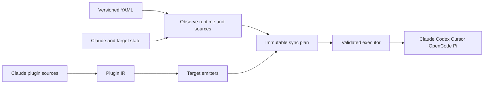

# Architecture

ai-config has two connected products: declarative Claude plugin reconciliation and Claude-plugin conversion for other coding tools. Both enter through the Click CLI, but mutation authority stays in narrower modules.

## Responsibility boundaries

| Boundary | Owner | Contract |
|---|---|---|
| Configuration | `config.py`, `types.py` | Parse config version 1 into frozen desired-state records; the only top-level target is Claude. |
| Claude runtime access | [Claude adapter](https://github.com/safurrier/ai-config/blob/main/src/ai_config/adapters/claude.py) | List and mutate Claude marketplaces and plugins. |
| Sync planning | `sync_pipeline.py` | Transform desired state, runtime snapshot, and resolved sources into an ordered immutable plan without mutation. |
| Observation and execution | `sync_orchestration.py` | Collect state, validate plan preconditions, execute authorized actions, and report partial progress. |
| Conversion source safety | `source_safety.py` | Traverse and read plugin-root-contained regular files through retained no-follow descriptors; source hashing uses the same boundary. |
| Conversion orchestration | [Sync conversion](https://github.com/safurrier/ai-config/blob/main/src/ai_config/sync_conversion.py), [conversion entry point](https://github.com/safurrier/ai-config/blob/main/src/ai_config/converters/convert.py) | Resolve source plugins, parse once, select emitters, and retain per-target results. |
| Skill projection | `src/ai_config/converters/skill_projection.py` | Purely materialize immutable shared include records, exact instruction rewrites, and per-copy evidence for every target. |
| Target semantics | [Target emitters](https://github.com/safurrier/ai-config/blob/main/src/ai_config/converters/emitters.py), target validators | Map IR components to each target and report native, transformed, degraded, or unsupported behavior. |
| Codex lifecycle | [Codex lifecycle](https://github.com/safurrier/ai-config/blob/main/src/ai_config/codex_lifecycle.py), [Codex adapter](https://github.com/safurrier/ai-config/blob/main/src/ai_config/adapters/codex.py) | Own generated package metadata and call Codex's marketplace/plugin lifecycle without writing shared Codex config directly. |
| Pi ownership | `pi_ownership.py` | Reconcile only ledger-proven output and preserve unowned or locally modified files. |

## Sync flow

Marketplace actions precede dependent Claude plugin actions. Conversion follows Claude reconciliation because conversion sources may come from installed or local marketplace plugins. The executor rechecks observed preconditions before mutation. It records completed and failed actions separately and commits cache or ownership checkpoints only where the plan permits them.

`--dry-run` renders the same materialized plan without runtime, cache, ownership, or filesystem mutation, except for a report explicitly requested with `convert --report PATH`. A real `--fresh` clears Claude's cache before observation; a fresh dry-run does not, because its mutation-free contract is stronger than simulating that altered observation.

## Conversion flow

`ClaudePluginParser` normalizes the source bundle into `PluginIR`. Emitters independently transform that IR into target output:

- Codex receives an ai-config-owned local marketplace and package under `.ai-config/codex/`, then Codex's CLI owns installation and enablement.
- Cursor and OpenCode receive path-contained target files. Containment prevents traversal but is not a general ownership ledger.
- Pi receives project `.pi/` or user `.pi/agent/` files through ledger-backed reconciliation.
- `targets/<target>/` files are copied last and may override generated bytes at the same target-relative path.
- Skills declaring `x-ai-config-includes` receive byte-preserved `_shared/<plugin-relative-path>` copies through one target-neutral projection; generated `SKILL.md` strips the declaration and exact declared root references become skill-root-relative paths.

The parser and emit-time source support readers share the same fail-closed containment authority. The
IR carries include bytes so emitters never reopen include source paths. Sync's source digest walks the
same regular-file universe and becomes unreadable if a symlink or special file could bypass it. This
source-read boundary does not remove the separate pre-existing check-then-write race at the validated
output path; output containment is not an atomic writer or additional ownership proof.

See [Sync and Conversion Pipelines](https://github.com/safurrier/ai-config/blob/main/ai_agent_docs/conversion-pipeline.md) for implementation detail and [Target Compatibility Baseline](https://github.com/safurrier/ai-config/blob/main/ai_agent_docs/target-compatibility-baseline.md) for runtime-specific evidence.
