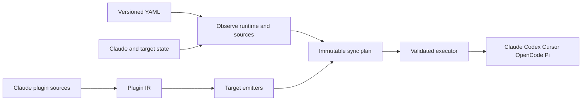

# Architecture

ai-config has two connected products. It reconciles declarative Claude plugins. It also converts Claude plugins for other coding tools. Both use the Click CLI. Smaller modules control mutation.

## Responsibility boundaries

| Boundary | Owner | Contract |
|---|---|---|
| Configuration | `config.py`, `types.py` | Parse config version 1 into frozen desired-state records. Claude is the only top-level target. |
| Claude runtime access | [Claude adapter](https://github.com/safurrier/ai-config/blob/main/src/ai_config/adapters/claude.py) | List and mutate Claude marketplaces and plugins. |
| Sync planning | `sync_pipeline.py` | Transform desired state, runtime snapshot, and resolved sources into an ordered immutable plan without mutation. |
| Observation and execution | `sync_orchestration.py` | Collect state, validate plan preconditions, execute authorized actions, and report partial progress. |
| Conversion source safety | `source_safety.py` | Traverse and read plugin-root-contained regular files with retained no-follow descriptors. Source hashing uses the same boundary. |
| Conversion orchestration | [Sync conversion](https://github.com/safurrier/ai-config/blob/main/src/ai_config/sync_conversion.py), [conversion entry point](https://github.com/safurrier/ai-config/blob/main/src/ai_config/converters/convert.py) | Resolve source plugins, parse once, select emitters, and retain per-target results. |
| Skill projection | `src/ai_config/converters/skill_projection.py` | Materialize immutable shared include records, exact instruction rewrites, and per-copy evidence for every target. |
| Target semantics | [Target emitters](https://github.com/safurrier/ai-config/blob/main/src/ai_config/converters/emitters.py), target validators | Map IR components to each target and report native, transformed, degraded, or unsupported behavior. |
| Codex lifecycle | [Codex lifecycle](https://github.com/safurrier/ai-config/blob/main/src/ai_config/codex_lifecycle.py), [Codex adapter](https://github.com/safurrier/ai-config/blob/main/src/ai_config/adapters/codex.py) | Own generated package metadata and call Codex's marketplace and plugin lifecycle. Never write shared Codex config directly. |
| Pi ownership | `pi_ownership.py` | Reconcile only ledger-proven output and preserve unowned or locally changed files. |

## Sync flow

Marketplace actions precede their dependent Claude plugin actions. Configured local marketplaces remain the conversion-source authority after installation. Remote and marketplace-less plugins can use safely observed installed sources.

A fresh remote source may not exist until Claude installs it. Sync applies one immutable Claude prerequisite plan. It observes once more and applies one conversion-only plan. It blocks the second plan when Claude reconciliation is still needed. Executors never replan or repeat runs until quiet. Each executor rechecks its runtime, source, cache, and ownership preconditions. It records completed and failed actions separately. It commits only permitted checkpoints.

`--dry-run` renders the first materialized plan. It makes no runtime, cache, ownership, or filesystem changes. `convert --report PATH` is the one exception and writes a requested report. Deferred remote conversion stays explicit because dry-run cannot inspect an unmade source. A real `--fresh` clears Claude's plugin cache before observation and forces configured conversion. It never clears target homes or ownership ledgers. A fresh dry-run clears nothing. Optional verification performs one final read-only plan only after every apply stage succeeds.

## Conversion flow

`ClaudePluginParser` normalizes the source bundle into `PluginIR`. Emitters transform that IR into target output:

- Codex gets an ai-config-owned local marketplace and package under `.ai-config/codex/`. Codex's CLI then owns installation and enablement.
- Cursor and OpenCode get path-contained target files. Containment blocks traversal but never serves as a general ownership ledger.
- Pi gets project `.pi/` or user `.pi/agent/` files through ledger-backed reconciliation.
- `targets/<target>/` files copy last. They can override generated bytes at the same target-relative path.
- Skills with `x-ai-config-includes` get byte-preserved `_shared/<plugin-relative-path>` copies through one target-neutral projection. Generated `SKILL.md` removes the declaration. Exact declared root references become skill-root-relative paths.

The parser and emit-time source readers share one fail-closed containment authority. The IR carries include bytes, so emitters never reopen source paths. Sync's source digest walks the same regular-file universe. It also hashes metadata for the exact repository mirror `CLAUDE.md -> AGENTS.md`. It proves that the sibling target is a no-follow regular file and never reads through the link. Every other symlink or special file makes the source unreadable. This boundary does not remove the separate check-then-write race at an output path. Output containment is not an atomic writer or ownership proof.

See [Sync and Conversion Pipelines](https://github.com/safurrier/ai-config/blob/main/ai_agent_docs/conversion-pipeline.md) for implementation detail. See [Target Compatibility Baseline](https://github.com/safurrier/ai-config/blob/main/ai_agent_docs/target-compatibility-baseline.md) for runtime-specific evidence.
